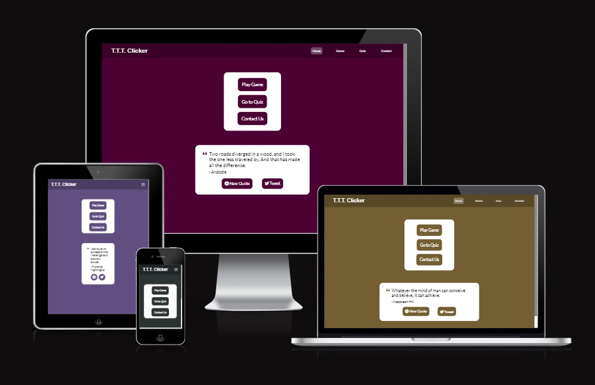

# Tic Tac Toe Clicker
(Developer Dillon Mc Caffrey)

[Live Site](https://dmccaffrey01.github.io/CI_PP2_TIC_TAC_TOE_CLICKER/) is hosted on Github Pages

## Table of Content

1. [Project Goals](#project-goals)
    1. [User Goals](#user-goals)
    2. [Site Owner Goals](#site-owner-goals)
2. [User Experience](#user-experience)
    1. [Target Audience](#target-audience)
    2. [User Requrements and Expectations](#user-requrements-and-expectations)
    3. [User Stories](#user-stories)
3. [Design](#design)
    1. [Design Choices](#design-choices)
    2. [Colour](#colours)
    3. [Fonts](#fonts)
    4. [Structure](#structure)
    5. [Wireframes](#wireframes)
4. [Technologies Used](#technologies-used)
    1. [Languages](#languages)
    2. [Frameworks & Tools](#frameworks-&-tools)
5. [Features](#features)
6. [Testing](#testing)
    1. [HTML Validation](#HTML-validation)
    2. [CSS Validation](#CSS-validation)
    3. [Accessibility](#accessibility)
    4. [Performance](#performance)
    5. [Device testing](#performing-tests-on-various-devices)
    6. [Browser compatibility](#browser-compatability)
    7. [Testing user stories](#testing-user-stories)
8. [Bugs](#Bugs)
9. [Deployment](#deployment)
10. [Credits](#credits)
11. [Acknowledgements](#acknowledgements)

## Project Goals

### User Goals
- Play A Clicker Game
- Play a Tic Tac Toe Game
- Play a Computer Quiz
- Have a fun time

### Site Owner Goals
- Create a fun clicker game
- Create a unique tic tac toe experience 
- Inform people about computers in a fun way
- Inspire people with a quote

## User Experience

### Target Audience
- People who are play clicker and idle games
- People looking for a unique tic tac toe game
- People into quiz games

### User Requirements and Expectations

- Functioning game mechanics and experience
- Visually appealing design and layout on any screen size
- Simple and fully functioning website including links and navigation
- Easy way to get in contact with the company
- Accessibility

### User Stories

#### Site User
1. I want a welcoming home page
2. I want to understand the rules and how to play the game
3. I want a leaderboard system for the game
4. I want to view my stats at the end of the game'
5. I want to save the game to keep my progress
6. I want to reset the game to restart my progress
7. I want background sound track and sound effects
7. I want to disable and change audio
8. I want to disable and enable animations
9. I want to enter my name when I have completed the game
10. I want a highscore system for the quiz
11. I want unique questions for the quiz
12. I want to enter my name when I ahve completed the quiz
13. I want to contact the creator

#### Site owner
14. I want the user to receive an inspirational quote
15. I want the user to understand the game
16. I want the user to get in contact with me
17. I want the user to return home when entering a url that doesn't exist

