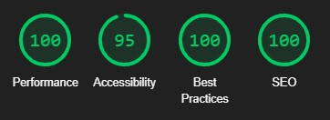

# Tic Tac Toe Clicker
(Developer Dillon Mc Caffrey)

[Live Site](https://dmccaffrey01.github.io/CI_PP2_TIC_TAC_TOE_CLICKER/) is hosted on Github Pages

## Table of Content

1. [Project Goals](#project-goals)
    1. [User Goals](#user-goals)
    2. [Site Owner Goals](#site-owner-goals)
2. [User Experience](#user-experience)
    1. [Target Audience](#target-audience)
    2. [User Requrements and Expectations](#user-requrements-and-expectations)
    3. [User Stories](#user-stories)
3. [Design](#design)
    1. [Design Choices](#design-choices)
    2. [Colour](#colours)
    3. [Fonts](#fonts)
    4. [Structure](#structure)
    5. [Wireframes](#wireframes)
4. [Technologies Used](#technologies-used)
    1. [Languages](#languages)
    2. [Frameworks & Tools](#frameworks-&-tools)
5. [Features](#features)
6. [Testing](#testing)
    1. [HTML Validation](#HTML-validation)
    2. [CSS Validation](#CSS-validation)
    3. [JS Validation](#javascript-validation)
    4. [Accessibility](#accessibility)
    4. [Performance](#performance)
    6. [Device testing](#performing-tests-on-various-devices)
    7. [Browser compatibility](#browser-compatability)
    8. [Testing user stories](#testing-user-stories)
7. [Bugs](#Bugs)
8. [Deployment](#deployment)
9. [Credits](#credits)
10. [Acknowledgements](#acknowledgements)

## Project Goals

### User Goals
- Play A Clicker Game
- Play a Tic Tac Toe Game
- Play a Computer Quiz
- Have a fun time

### Site Owner Goals
- Create a fun clicker game
- Create a unique tic tac toe experience 
- Inform people about computers in a fun way
- Inspire people with a quote

## User Experience

### Target Audience
- People who are play clicker and idle games
- People looking for a unique tic tac toe game
- People into quiz games

### User Requirements and Expectations

- Functioning game mechanics and experience
- Visually appealing design and layout on any screen size
- Simple and fully functioning website including links and navigation
- Easy way to get in contact with the company
- Accessibility

### User Stories

#### Site User
1. I want a welcoming home page
2. I want to understand the rules and how to play the game
3. I want a leaderboard system for the game
4. I want to view my stats at the end of the game
5. I want to save the game to keep my progress
6. I want to reset the game to restart my progress
7. I want background sound track and sound effects
8. I want to disable and change audio
9. I want to disable and enable animations
10. I want to enter my name when I have completed the game
11. I want a highscore system for the quiz
12. I want unique questions for the quiz
13. I want to enter my name when I have completed the quiz
14. I want to contact the creator

#### Site owner
15. I want the user to receive an inspirational quote
16. I want the user to understand the game
17. I want the user to get in contact with me
18. I want the user to return home when entering a url that doesn't exist
19. I want the user to easily navigate through the website

## Design

### Design Selection
The website was designed to have a feeling of minimalistic and new to match the unique game

### Colour
The colour scheme is a minimal gray and blue to help the user focus on the game and not have the background stand out. I choose the colour scheme and tested the contrast using WebAIM.

### Fonts
Google Fonts were used throughout the whole page.
Source-Sans-Pro was used for the navigation bar including the logo with sans-serif as a fallback.
Lato was used for the body with sans-serif as a fallback.

### Structure
The page is strucutred in a well known, recognizable, user friendly, and easy to learn way. When reaching the website the user sees the company logo on the left and a navigation menu button on the right.
The website has 4 seperate pages and 1 404 error page rerouting the user back to the home page.
- Home page including a card with navigation buttons and a random quote generator
- Game page with buttons to start the interactive clicker game, a how to play section, and a leaderboard section
    - Game includes main area where monster stats, and power are displayed and the monster to click
    - Includes a setting section where time is displayed along with save and reset game options along with audio, display and cheat options
    - Includes a upgrade shop section where coins are displayed along with buttons to buy upgrades
    - How to play section includes card with text description along with gifs on how the game works
    - Leaderboard seciton includes players name and time along with a view stats link to check players game stats
- Quiz page with buttons to start the computer quiz and a highscore section
    - Quiz includes a question with 4 answer choics
    - Highscores section includes name and points of player
- Contact page to enter your name and email and leave a message

### Wireframes

Wireframes were created desktop first and outline the initial design concept for the website
 

Home Page Wireframe

 

 

Game Mobile Wireframe

 

 

Game Tablet Wireframe

 

 

Game Desktop Wireframe

 

 

Quiz Page Wireframe

 

 

Contact Page Wireframe

 

 

404 Error Page Wireframe

 

 

## Technologies Used

### Languages
- HTML
- CSS
- Javascript

### Frameworks & Tools
[Balsamiq](https://balsamiq.com/wireframes/) - Used to for wireframes.

[Github](https://github.com/) - To save and store the files for the website and for version control.

[Github Pages](https://pages.github.com/) (Jekyll) - to host the site 

[W3C validator](https://validator.w3.org/) - to test for syntax errors in HTML code

[Jigsaw CSS validator](https://jigsaw.w3.org/css-validator/) - check for syntactic errors in the css code 

[WAVE Web Accessibility Evaluation Tool](https://wave.webaim.org/) - check accessibility

[Google Fonts](https://fonts.google.com/about) - fonts used on the website were imported from here

[Font Awesome](https://fontawesome.com/search) - for iconography on the website

[Google Dev Tools](https://developer.chrome.com/docs/devtools/) - troubleshooting and testing features as well as implement responsive styling

[GitPod](https://www.gitpod.io/) - for active development 

[Tiny PNG](https://tinypng.com/) - compressing images.

[Favicon.io](https://favicon.io/) - create favicon.

[Am I Responsive?](https://ui.dev/amiresponsive) - prototyping website image on a range of devices.

## Features
The website consists of five pages, four are accessible through the navigation menu (index/home page, game page, quiz page, contact page). The last page is a 404 error page which the user can click a button to return home.

### Logo and Navigation Bar
- Featured on all five pages
- The Logo when clicked brings the user back to the home page
- The navbar is uses a hamburger menu that when clicked opens a transparent dropdown menu with links to the home, game, quiz and contact pages
- It is easy for the user to navigate through the website
- The page the user is currently on gets highlighted
- User stories covered: 19

### Home page navigation card
- A card with 3 buttons in it, play game, play quiz and contact
- Play game button brings you to the game page where you can play the game
- Play quiz button brings you to the quiz page where you can play the quiz
- Contact button brings you to the contact page where you can send a message
- User stories covered: 1, 19

### Quote
- A card where a random quote is displayed
- There is a new quote button that when pressed displays a new quote and author, the background colour of website is also changed
- There is a tweet button that when pressed brings the user to twitter and automatically generates a quote for the user to tweet
- User stories covered: 15

### Footer
- Displayed on all five pages
- Displays copyrigh and social media links
- The links bring you to github, linkedIn and email

### Game start screen
- A card that displays 3 buttons
- Play starts the game and opens the game section
- How to play opens the how to play section where rules and instructions of the game are displayed
- Leaderboard opens up the game leaderboard

### How to play
- Information on how the game is played
- Includes text and a gif image showing the game functions
- Includes close button to return to start screen
- User stories covered: 2, 16

### Leaderboard
- Displays players of the game and the time they completed the game
- There is a view stats button so the user can view the stats the player had during that game
- Includes close button to return to start screen
- Includes reset button to reset the leaderboard
- User stories covered: 3

### Stats
- Displays the stats of the player during that game
- Includes time, power, total clicks and total coins
- Includes close button to return to leaderboard
- User stories covered: 4

### Game
- Displays when play button is clicked
- Includes monster stats, monster clicker, power stats, time, coins, settings button and shop button

### Monster stats
- Displays information on the current level, monster count, monster health bar and monster health points (hp)

### Power stats
- Displays information on the players current power

### Coins
- Displays player coins
- These coins can be used to purchase upgrades

### Timer
- Displays player time
- Starts incrementing when game starts

### Monster clicker
- A monster with an island background is displayed
- This monster can be clicked on to deal damage to it decreasing its health points (hp)

### Monster damage
- Once the monster is clicked damage is dealt to the monster equal to the players power
- The monster health bar shrinks and the number decreases
- A fading and ascending number appears where clicked equal to the power
- A hitmarker sound effect plays when clicked
- The monster animates when taking damages and decreases in size
- Once enough damage is dealt the monster dies

### Monster death
- Once enough damage is dealt to the monster and its hp is 0 or below it dies and disappears
- The monster animates, it shakes and decreases in size to nothing
- Coins are then dropped from the monster in random directions, each coin displayed is worth 10 coins
- The coins are then collected and players coins increases
- After a while a new monster spawns
- A sound effect plays when monster dies

### Coin collection
- Coins are spread out after a monster dies
- The coins are then brought to one area and collected
- A green fading ascending number appears at coins and the players coins increases
- A sound effect plays when coins are collected

### New monster
- After a monster has died after a few seconds a new monster respawns
- The monster changes to a different monster
- The monster gains hp and the monster count changes by 1

### Level up
- After 10 monsters have been killed the game levels up
- Monster hp increases so the game gets harder
- Coins from monsters also increases
- The island in the background changes with a shake animation
- A sound effect plays

### Shop
- The shop button can be clicked on the right hand side
- This opens the shop where upgrades can be purchased

### Buy upgrade
- There is 3 upgrades to buy
- An upgrade increases the power of the player and costs coins to buy
- Each upgrade costs a different amount and increases power by a diffent amount
- Upgrade 1 starts at 50 and increases power by 1, upgrade 2 starts at 500 and increases power by 5, upgarde 3 starts at 5000 and increases power by 10
- After an upgrade is bought, power increases and a fading number appears beside power, coins are removed and a fading number appears beside coins, the cost of the upgrade also increase and a fading number appears beside costs, upgrade count also increases
- A buy delay also happens indicated by a bar that shrinks and gets larger
- A sound effect plays when an upgrade is bought

### Settings
- The settings button can be clicked on the left hand side
- This opens the settings where the game can be saved and reset and settings changed
- There is a return and close button that closes the menu

### Save game 
- When the settings menu has opened there is 3 options, save game, reset game and settings
- When the save game button is clicked the game saves to local storage
- This means when the browser is refreshed your game will load in and your progress will be saved
- The game can also be saved by pressing control + s on the keyboard
- The game also auto saves every 30 seconds
- When game has saved, text appears at the top of the screen to let the player know
- User stories covered: 5

### Reset game
- When the settings menu has opened there is 3 options, save game, reset game and settings
- When the reset game button is clicked, a confirm message appears on screen
- The player can click ok or cancel to confirm 
- If the player clicks ok, their game local storage will reset and the game will restart
- User stories covered: 6

### Settings menu
- When the settings menu has opened there is 3 options, save game, reset game and settings
- When the settings button is clicked, the game disappears and a settings menu appears
- This settings menu has 3 buttons: audio, display and secret

### Audio settings
- When the audio button is clicked in the settings menu, audio settings appear
- There are 2 toggles and 2 sliders
- The first toggle enables and disables music and the slider changes the volume of the music
- The second toggle enables and disables sound effects and the slider changes the volume of the sound effects
- User stories covered: 7, 8

### Display settings
- When the display button is clicked in the settings menu, display settings appear
- There are 5 toggles including a disable/enable all
- These toggles enable or disable animations in the game
- User stories covered: 9

### Secret 
- The the secret button is clicked in the settings menu, secret menu appears
- A password input appears with a unlock button
- The user must type in the correct password to unlock cheats
- If password is incorrect, a error message is typed
- If password is correct, a success message is typed and the button unlocks to enter to cheats
- The password is distinctiondillon123

### Cheats
- Once password has been entered and unlock button clicked, the cheats setting appears
- There is 4 cheats to change
- First is the players power which changes the players power and damage dealt to monster and is a number input
- Second is monsters per level which changes the amount of monsters needed to be killed to level up and is a slider
- Third is coins per monster which changes the amount of coins dropped when a monster dies and is a number input
- Last is and easy game toggle which changes the timing game to become easier

### Timing game
- After 5 monsters have been killed a timing game starts
- First a number flashed on screen and fades out, this number is your target
- After that the timing game starts, this is where a bar goes side to side across a container, the goal is press the attack button when the bar is in the green area and not the red
- There is a 10 second timer to reach the target number
- If the attack button is pressed and the bar is in the green area the counter increase and you have to get the count to the target number, the green area moves once clicked
- If the attack button is pressed and the bar is in the red area the timer decreases by 1 second
- If the target is not reached the monster respawns and you have to do the timing game all over again
- If the target is reached the monster dies and a new one spawns

### Boss
- At every 5 levels there is a boss round
- Boss rounds only have 1 monster to kill to level up but the monster has more hp
- If the boss is killed, a game of tic tac toe is played
- The backgrouind turns red and a boss icon appears

### Tic Tac Toe game
- After every boss round, a game of tic tac toe starts
- The aim of the game is to match 3 symols together
- You start by placing an x in a 3 x 3 grid
- The cpu then places an o
- After 3 symbols has been placed someone wins
- If the player wins he gains extra power

### Win the game
- After beating 20 levels and winning tic tac toe you will beat the game
- A congratulations will appear and then a screen to enter your name
- Once you enter your name the game will bring you to the leaderboards
- User stories covered: 10

### Quiz start screen
- A card that displays 2 buttons, one to play the quiz another to go to the highscores

### Quiz game
- Once play quiz button is clicked the quiz game appears
- This includes a heads up display (hud) with score and question count, the question, and the 4 answer options

### Quiz HUD
- The heads up display (hud) includes the players score and current question counter

### Quiz question
- Displays the current quiz question
- Pulls random unique computer quesions from API
- User stories covered: 12

### Quiz answers
- Displays 4 answers to the question
- Player can click on an answer and is shown if correct by colour it changes if green correct and red incorrect
- Pulls answers from API

### Quiz name entry
- After 10 quiz questions have been answered a screen where the player can save their name is displayed
- The player writes their name and the score and name are saved to highscores if they make the top 5
- User stories covered: 13

### Highscores
- After clicking the highscores button, the highscores screen appears
- The top 5 scores and names are displayed
- A return to the homescreen button is also displayed
- User stories covered: 11

### Contact
- Form with name, email and message to send
- After clickind send button an alert pops up to confirm the message
- User stories covered: 14, 17

### Error 404
- If the user enters a invalid url the website brings the user to a 404 page
- Displays error message and has a return to home page button
- User stories covered: 18

## Testing
 
### HTML Validation

To validate the HTML of the website, W3C Markup Validation service was used

- index.html: [Results](https://validator.w3.org/nu/?doc=https%3A%2F%2Fdmccaffrey01.github.io%2FCI_PP2_TIC_TAC_TOE_CLICKER%2Findex.html) - No Errors Found

2 Warning displayed
| **Level** | **Feature** | **Issue Description** | **Comment** |
|-------------|-------------|----------------------|-------------|
| Warning | `<section id="home-buttons" class="home-section">` | Section lacks heading. Consider using h2-h6 elements to add identifying headings to all sections, or else use a div element instead for any cases where no heading is needed. | Section appropriately only includes navigation |
| Warning | `<section id="random-quote-section" class="home-section">` | Section lacks heading. Consider using h2-h6 elements to add identifying headings to all sections, or else use a div element instead for any cases where no heading is needed. | Section appropriately only includes random quote generator |

- game.html: [Results](https://validator.w3.org/nu/?doc=https%3A%2F%2Fdmccaffrey01.github.io%2FCI_PP2_TIC_TAC_TOE_CLICKER%2Fgame.html) - No Errors Found

9 Warning displayed
| **Level** | **Feature** | **Issue Description** | **Comment** |
|-------------|-------------|----------------------|-------------|
| Warning | `<section class="start-screen"` | Section lacks heading. Consider using h2-h6 elements to add identifying headings to all sections, or else use a div element instead for any cases where no heading is needed. | Section appropriately only includes start buttons |
| Warning | `<section class="kill-monster-section">` | Section lacks heading. Consider using h2-h6 elements to add identifying headings to all sections, or else use a div element instead for any cases where no heading is needed. | Section appropriately only includes kill monster game |
| Warning | `<section class="ttt-section">` | Section lacks heading. Consider using h2-h6 elements to add identifying headings to all sections, or else use a div element instead for any cases where no heading is needed. | Section appropriately only includes tic tac toe game |
| Warning | `<section class="settings-section">` | Section lacks heading. Consider using h2-h6 elements to add identifying headings to all sections, or else use a div element instead for any cases where no heading is needed. | Section appropriately only includes settings |
| Warning | `<section class="htp-section">` | Section lacks heading. Consider using h2-h6 elements to add identifying headings to all sections, or else use a div element instead for any cases where no heading is needed. | Section appropriately only includes how to play |
| Warning | `<section class="leaderboard-section">` | Section lacks heading. Consider using h2-h6 elements to add identifying headings to all sections, or else use a div element instead for any cases where no heading is needed. | Section appropriately only includes leaderboard |
| Warning | `<section class="stats-section">` | Section lacks heading. Consider using h2-h6 elements to add identifying headings to all sections, or else use a div element instead for any cases where no heading is needed. | Section appropriately only includes stats |
| Warning | `<section class="congrats-section">` | Section lacks heading. Consider using h2-h6 elements to add identifying headings to all sections, or else use a div element instead for any cases where no heading is needed. | Section appropriately only includes congrats |
| Warning | `<section class="alert-section">` | Section lacks heading. Consider using h2-h6 elements to add identifying headings to all sections, or else use a div element instead for any cases where no heading is needed. | Section appropriately only includes alerts |

- quiz.html: [Results](https://validator.w3.org/nu/?doc=https%3A%2F%2Fdmccaffrey01.github.io%2FCI_PP2_TIC_TAC_TOE_CLICKER%2Fquiz.html) - No Errors Found

4 Warning displayed
| **Level** | **Feature** | **Issue Description** | **Comment** |
|-------------|-------------|----------------------|-------------|
| Warning | `<section class="quiz-home">` | Section lacks heading. Consider using h2-h6 elements to add identifying headings to all sections, or else use a div element instead for any cases where no heading is needed. | Section appropriately only includes home buttons |
| Warning | `<section class="quiz-game-section fade">` | Section lacks heading. Consider using h2-h6 elements to add identifying headings to all sections, or else use a div element instead for any cases where no heading is needed. | Section appropriately only includes quiz game |
| Warning | `<section class="quiz-end-section fade">` | Section lacks heading. Consider using h2-h6 elements to add identifying headings to all sections, or else use a div element instead for any cases where no heading is needed. | Section appropriately only includes quiz end screen |
| Warning | `<section class="high-scores-section fade">` | Section lacks heading. Consider using h2-h6 elements to add identifying headings to all sections, or else use a div element instead for any cases where no heading is needed. | Section appropriately only includes high scores |

- contact.html: [Results](https://validator.w3.org/nu/?doc=https%3A%2F%2Fdmccaffrey01.github.io%2FCI_PP2_TIC_TAC_TOE_CLICKER%2Fcontact.html) - No Errors Found

2 Warning displayed
| **Level** | **Feature** | **Issue Description** | **Comment** |
|-------------|-------------|----------------------|-------------|
| Warning | `<section class="contact-form-section">` | Section lacks heading. Consider using h2-h6 elements to add identifying headings to all sections, or else use a div element instead for any cases where no heading is needed. | Section appropriately only includes contact form |
| Warning | `<section class="alert-section">` | Section lacks heading. Consider using h2-h6 elements to add identifying headings to all sections, or else use a div element instead for any cases where no heading is needed. | Section appropriately only includes alerts |

- 404.html: [Results](https://validator.w3.org/nu/?doc=https%3A%2F%2Fdmccaffrey01.github.io%2FCI_PP2_TIC_TAC_TOE_CLICKER%2F404.html) - No Errors Found

0 Warning displayed

### CSS Validation

To validate the CSS of the website W3C Jigsaw CSS Validation Service was used

site [results](https://jigsaw.w3.org/css-validator/validator?uri=https%3A%2F%2Fdmccaffrey01.github.io%2FCI_PP2_TIC_TAC_TOE_CLICKER%2F&profile=css3svg&usermedium=all&warning=1&vextwarning=&lang=en)
- No Errors Found.

112 Warnings due to using CSS variables for colour as they are not statically checked.
More information about this in the [Bugs](#bugs) section

### JavaScript Validation

JSHint JS Validation Service was used to validate the Javascript files. No significant issues were found.

index.js

nav-menu.js

game.js

quiz.js

contact.js

### Accessibility

To ensure the website met high accessibility standards the WAVE WebAIM web accessibility evaluation tool was used

- index.html: [Results](https://wave.webaim.org/report#/https://dmccaffrey01.github.io/CI_PP2_TIC_TAC_TOE_CLICKER/index.html)
- game.html: [Results](https://wave.webaim.org/report#/https://dmccaffrey01.github.io/CI_PP2_TIC_TAC_TOE_CLICKER/game.html)
- quiz.html: [Results](https://wave.webaim.org/report#/https://dmccaffrey01.github.io/CI_PP2_TIC_TAC_TOE_CLICKER/quiz.html)
- contact.html: [Results](https://wave.webaim.org/report#/https://dmccaffrey01.github.io/CI_PP2_TIC_TAC_TOE_CLICKER/contact.html)
- 404.html: [Results](https://wave.webaim.org/report#/https://dmccaffrey01.github.io/CI_PP2_TIC_TAC_TOE_CLICKER/404.html)

All the pages mostly had the same issues

#### Errors

There was 3 errors in all the pages. All had to do with empty links in footer of page, because I used icons instead of text this flagged an error.

#### Alerts

The alerts are high on all pages but most of them are to do with links which I had to use CSS tricks to get around, some of them are possible heading alerts aswell

### Performance

Performance testing was performed on lighthouse in Google Chrome's DevTools

#### index.html

Issues:
No issues

#### game.html

Issues:
No issues

#### quiz.html

Issues:
No issues

#### contact.html

Issues:
No issues

#### 404.html

Issues:
No issues

### Device testing

The website was tested on the following devices:

1. Iphone 11
2. Desktop
3. Google Chrome Developer Tools for responsive sizes

### Browser Compatibility

The website was tested on the following browsers:
1. Google Chrome
2. Mozilla Firefox

### Testing user stories

1. I want a welcoming home page

| **Feature** | **Action** | **Expected Result** | **Actual Result** |
|-------------|------------|---------------------|-------------------|
| Home page navigation card | Navigate to Home Page and view nav card and quote generator | Works as expected | 

 

Home page navigation card Results

 

 

 

2. I want to understand the rules and how to play the game

| **Feature** | **Action** | **Expected Result** | **Actual Result** |
|-------------|------------|---------------------|-------------------|
| How to play | Navigate to game page, click how to play button, view how to play rules | Works as expected | 

 

How to play Results

 

 

 

3. I want a leaderboard system for the game

| **Feature** | **Action** | **Expected Result** | **Actual Result** |
|-------------|------------|---------------------|-------------------|
| Leaderboard | Navigate to game page, click leaderboard button, view leaderboard | Works as expected | 

 

Leaderboard Results

 

 

 

4. I want to view my stats at the end of the game

| **Feature** | **Action** | **Expected Result** | **Actual Result** |
|-------------|------------|---------------------|-------------------|
| Stats | Navigate to game page, click leaderboard button, click the view stats, view stats | Works as expected | 

 

Stats Results

 

 

 

5. I want to save the game to keep my progress

| **Feature** | **Action** | **Expected Result** | **Actual Result** |
|-------------|------------|---------------------|-------------------|
| Save Game | Navigate to game page, click play button, click settings button, click save button, game saved | Works as expected | 

 

Save Results

 

 

 

6. I want to reset the game to restart my progress

| **Feature** | **Action** | **Expected Result** | **Actual Result** |
|-------------|------------|---------------------|-------------------|
| Reset Game | Navigate to game page, click play button, click settings button, click reset button, game reset | Works as expected | 

 

Reset Results

 

 

 

7. I want background sound track and sound effects

| **Feature** | **Action** | **Expected Result** | **Actual Result** |
|-------------|------------|---------------------|-------------------|
| Audio settings | Navigate to game page, click play button, click settings button, click settings button, click audio settings, game audio | Works as expected | 

 

Audio Results

 

 

 

8. I want to disable and change audio

| **Feature** | **Action** | **Expected Result** | **Actual Result** |
|-------------|------------|---------------------|-------------------|
| Audio settings | Navigate to game page, click play button, click settings button, click settings button, click audio settings, game audio | Works as expected | 

 

Audio change Results

 

 

 

9. I want to disable and enable animations

| **Feature** | **Action** | **Expected Result** | **Actual Result** |
|-------------|------------|---------------------|-------------------|
| Display settings | Navigate to game page, click play button, click settings button, click settings button, click display settings, game display | Works as expected | 

 

Display settings Results

 

 

 

10. I want to enter my name when I have completed the game

| **Feature** | **Action** | **Expected Result** | **Actual Result** |
|-------------|------------|---------------------|-------------------|
| Win the game | Navigate to game page, click play button, play the game, at the end an input box appears to enter your name  | Works as expected | 

 

Win the game Results

 

 

 

11. I want a highscore system for the quiz

| **Feature** | **Action** | **Expected Result** | **Actual Result** |
|-------------|------------|---------------------|-------------------|
| Highscores | Navigate to quiz page, click highscores button, view highscores | Works as expected | 

 

Highscores Results

 

 

 

12. I want unique questions for the quiz

| **Feature** | **Action** | **Expected Result** | **Actual Result** |
|-------------|------------|---------------------|-------------------|
| Quiz question | Navigate to quiz page, click play quiz button, view quiz question | Works as expected | 

 

Quiz question Results

 

 

 

13. I want to enter my name when I have completed the quiz

| **Feature** | **Action** | **Expected Result** | **Actual Result** |
|-------------|------------|---------------------|-------------------|
| Quiz name entry | Navigate to quiz page, click play quiz button, play quiz, at the end input appears to enter name | Works as expected | 

 

Quiz name entry Results

 

 

 

14. I want to contact the creator

| **Feature** | **Action** | **Expected Result** | **Actual Result** |
|-------------|------------|---------------------|-------------------|
| Contact | Navigate to contact page, fill in your details, click send button | Works as expected | 

 

Contact Results

 

 

 

15. I want the user to receive an inspirational quote

| **Feature** | **Action** | **Expected Result** | **Actual Result** |
|-------------|------------|---------------------|-------------------|
| Quote | Navigate to home page, view quote generator | Works as expected | 

 

Quote Results

 

 

 

16. I want the user to understand the game

| **Feature** | **Action** | **Expected Result** | **Actual Result** |
|-------------|------------|---------------------|-------------------|
| How to play | Navigate to game page, click how to play button, view how to play rules | Works as expected | 

 

How to play Results

 

 

 

17. I want to contact the creator

| **Feature** | **Action** | **Expected Result** | **Actual Result** |
|-------------|------------|---------------------|-------------------|
| Contact | Navigate to contact page, fill in your details, click send button | Works as expected | 

 

Contact Results

 

 

 

18. I want the user to return home when entering a url that doesn't exist

| **Feature** | **Action** | **Expected Result** | **Actual Result** |
|-------------|------------|---------------------|-------------------|
| Error 404 | Navigate to any invalid url, site brings you to 404 page, click return home button | Works as expected | 

 

Error 404 Results

 

 

 

19. I want the user to easily navigate through the website

| **Feature** | **Action** | **Expected Result** | **Actual Result** |
|-------------|------------|---------------------|-------------------|
| Logo and Navigation Bar | On any of the pages, go to the header and there will be a nav bar with working links to all pages | Works as expected | 

 

Logo and Navigation Bar Results

 

 

 

## Bugs 

### Clicker Game glitch
During the game as the player clicks and kills the monster, if the player is clicking to fast the monster and the timing game starts the game can glitch out and breaks the timing game then the monster changes every second.
I tried to fix this by adding a monster spawn delay and also adding an isMonsterDead variable to help block the clicks as the monster dies but still sometimes the game can still glitch.

## Deployment & Local Development

The Following steps require a logged in github account.

### Deployment
Github Pages was used to deploy the live website.
To deploy a live website using github pages these instructions can be followed [here](https://docs.github.com/en/pages/getting-started-with-github-pages/creating-a-github-pages-site)

### How to Fork
To fork this repository:

1. Go to the repository for this project.
2. Click the Fork button in the top right corner.

### How to Clone
To clone this repository:

1. Go to the repository for this project.
2. Click on the code button, select whether you would like to clone with HTTPS, SSH or GitHub CLI and copy the link shown.
3. Open the terminal in your code editor and change the current working directory to the location you want to use for the cloned directory.
4. Type 'git clone' into the terminal and then paste the link you copied in step 3. Press enter.

## Credits

### Code Used
[Tankot Games](https://www.youtube.com/watch?v=d-AbDEwpp6g&list=PLEyTwruuVAqlEvj8QxTFdVPc6_AwpgF2w&ab_channel=TanktotGames) for help with building clicker game
[FreeCodeCamp](https://www.freecodecamp.org/learn/) for help with javascript used in random quote generator and quiz
[Stackoverflow](https://stackoverflow.com/) for help with javascript bugs
[W3C Schools](https://www.w3schools.com/) for various CSS help
[MDM web docs](https://developer.mozilla.org/en-US/docs/Learn/CSS/CSS_layout) for various CSS help

### Media

- Most images were taken from [Pexels](https://www.pexels.com/) and [freepik](https://www.freepik.com/)
- Most audio were taken from [BreakCopyright](https://www.youtube.com/@BreakingCopyright) and [freesound](https://freesound.org/)

## Acknowledgements

I would like to thank and acknowledge the following people who helped me along the way in completting this project:

Code Institute - for giving me guideance and support throughout the project

Mo Shami - for being the mentor to guide me through the project and give essential feedback

Amy Connolly - for peer reviewing and giving feedback on the website

Gary Mc Caffrey - for peer reviewing and giving feedback on the project